# DJ Agent Project with Google ADK

### A. Setup environment

1. Open this project in VSCode

2. Open Terminal in VSCode by

   a. Pressing `Cmd + Shift + P` (on MacOS) or `Ctrl + Shift + P` (on Windows) to open the `Command Pallet` on VSCode.

   b. In `Command Pallet`, type to search for `Terminal` then select `Terminal: Create New Terminal (In Active Workspace)`. Example below.
   

3. Then create a virtual environment for this project by executing the following command in the Terminal.

   ```
   python -m venv .venv
   ```

   

   ###### What is virtual environment ?

   > A python environment is can be easily understand as a collection of all python libraries and tools that are installed and for your coding.

   > When you installed python for the first time there will be a global python environment, created at your machine level and will be used for all of your project by default.

   > However if you have multiple projects that require different libraries, sometime they will conflict with each other, especially for the version of the library. For example, project `cool-web-server` requires library `flask` version `3.1.0` while project `old-but-gold` use libry `flask` version `2.3.0`. So when we install library `flash` version `3.1.0` it will break code of project `old-but-gold`.

   > Virtual environment then come to help as a solution for us to create a separate python environment per project. Hence we don't have to worry about if install library for project `A` may break project `B`.

4. You will now see a new folder named `.venv` which storing our new python virtual environment. We will need to tell VSCode to use python in this virtual environment.

   a. Open the `Command Pallet` again and search for `Python: Select Interpreter`
   

   b. A new Pallet will be open and you need to select the python environment that you have just created above by typing in the text box `.venv` and select the one that pointing to the virtual environment folder `.venv`.
   

5. Now you all set. Restart VSCode and reopen the project for it to reload with your new virtual environment.

6. Now open the `Terminal` of VSCode again and this time we will install libraries for this project.

   a. If you have Python version < 3.13, then you can skip this step. Now if you have python version >= 3.13 then we will need to install pip first. In `Terminal` of VSCode, execute the following command to install pip. If this step finished then you can go to step `b`.

   ```
   python -m ensurepip --upgrade
   ```

   b. Install libraries listed on `requirements.txt` file by execute the following command in `Ternimal` of VSCode.

   ```
   pip install -r requirements.txt
   ```

7. Now you have your python virtual environment all set. Let's get started.

### B. Register for Google AI Studio and get API Key to access Gemini models

Note: You will need a Google Mail account to register for Google AI Studio.

1. Open `https://aistudio.google.com/` in your web browser. And accept the terms and conditions to register for Google AI Studio.
   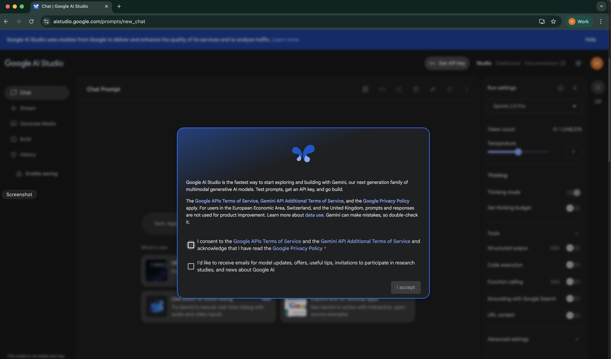

2. After registered, you will be redirected to the Google AI Studio dashboard. Click on `Get API key` on the top bar right hand side.
   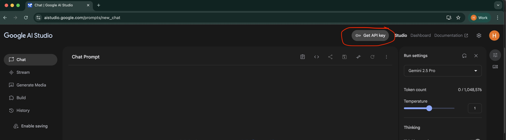

3. You will be redirected to another page to create a new API key. Click on `Create API Key` button on the top right hand side.
   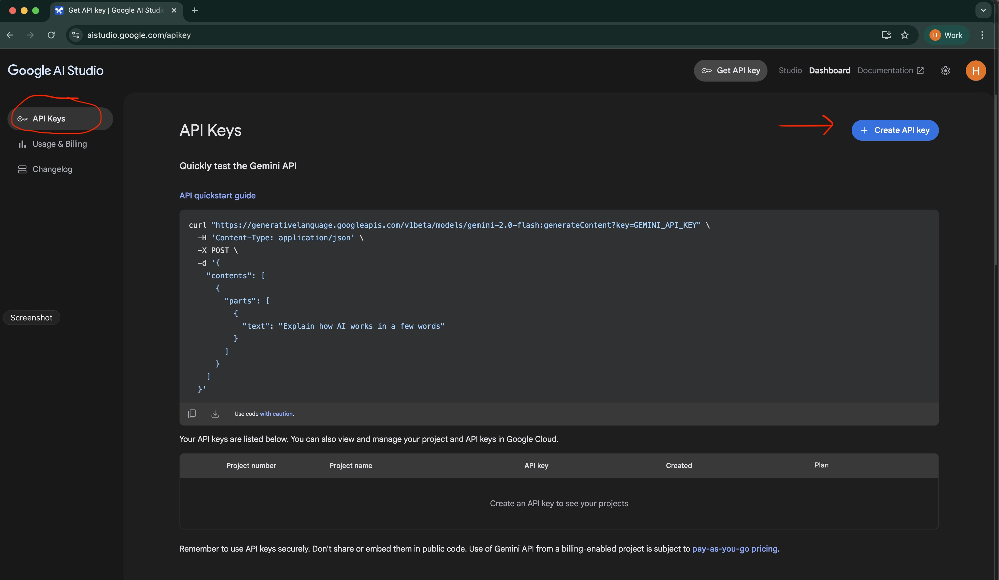

4. Then a popup will appear to show you the API key.
   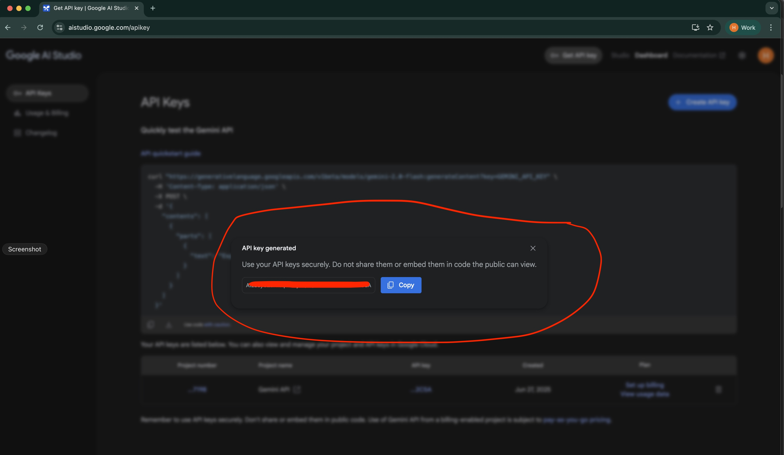

5. Now you have an API key to access Gemini models. Just close the popup, we will continue to the next steps.

### C. Create your first weather agent with Google ADK

1. Open Terminal in VSCode by

   a. Pressing `Cmd + Shift + P` (on MacOS) or `Ctrl + Shift + P` (on Windows) to open the `Command Pallet` on VSCode.

   b. In `Command Pallet`, type to search for `Terminal` then select `Terminal: Create New Terminal (In Active Workspace)`. Example below.
   

2. In the Terminal, execute the following command to create a new agent named `my-first-agent`.
   ```bash
   adk create my-first-agent
   ```

   Note: if the command above does not work, you can try to run it with `python -m` prefix like this:
   
   ```bash
   python -m adk create my-first-agent
   ```

3. The command will then ask you to select a model for your agent. Type `2` to select option `2` because we will use a free model later.
   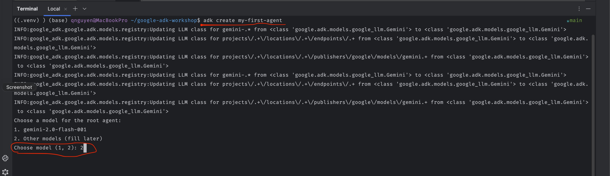
   
4. Now you will see a new folder named `my-first-agent` created in the project folder. This is your first agent project.
   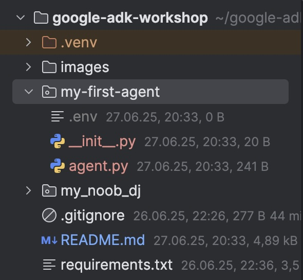

5. Inside the `my-first-agent` folder, you will see 3 files cerated for you:
   - `agent.py`: This is the main file of your agent, where you will write the code to define the behavior of your agent.
   - `.env`: This file is used to store environment variables, such as your API key for Google AI Studio.
   - `__init__.py`: This file is used to mark the folder as a Python package, so you can import your agent in other Python files.

6. Open the `.env` file in the `my-first-agent` folder.
   Paste the following lines into the `.env` file:
   ```
   GOOGLE_GENAI_USE_VERTEXAI=FALSE
   GOOGLE_API_KEY=<YOUR_API_KEY>
   ```
   
7. Now we will get the API key that you created in Section B with the following steps.
   a. Go back to the Google AI Studio API Key page `https://aistudio.google.com/apikey`. 
      You can see that there is a new API key created for you. Click on the key, I'll show you in the picture below.
      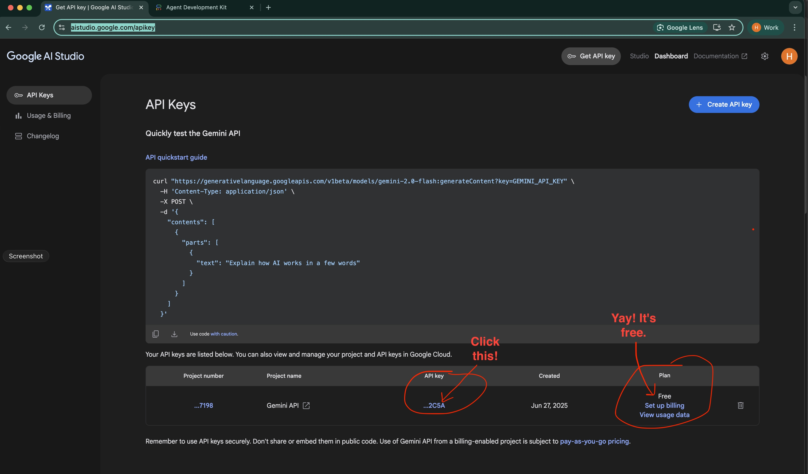
   
   b. A popup will appear. You can click on the `Copy` button to copy the API key to your clipboard.
      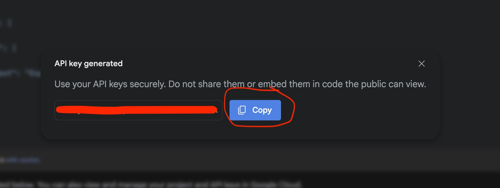

   c. Now go back to the `.env` file in the `my-first-agent` folder and replace `<YOUR_API_KEY>` with the API key that you just copied. It should look like this:
   ```   
   GOOGLE_GENAI_USE_VERTEXAI=FALSE
   GOOGLE_API_KEY=AIzaSyD-xxxxxxxxxxxxxxxxxxxxxxxxxxxx
   ```
   
8. Open the `agent.py` file in the `my-first-agent` folder. 
   You will see a simple agent code that is already written for you like below:
   ```python
   from google.adk.agents import Agent

   root_agent = Agent(
       model='<FILL_IN_MODEL>',
       name='root_agent',
       description='A helpful assistant for user questions.',
       instruction='Answer user questions to the best of your knowledge',
   )
   ```

9. At the line `model='<FILL_IN_MODEL>'`, replace `<FILL_IN_MODEL>` with the model name `gemini-2.0-flash-exp`:
   ```python
   from google.adk.agents import Agent

   root_agent = Agent(
       model='gemini-2.0-flash-exp',
       name='root_agent',
       description='A helpful assistant for user questions.',
       instruction='Answer user questions to the best of your knowledge',
   )
   ```

10. Awesome! Now let's test your simple agent. Lucky for us, Google ADK provides an WebUI for us to test our agent easily.
    Open the Terminal in VSCode again and execute the following command to start the WebUI for your agent:
    ```bash
    adk web
    ```
    You will see the following output in the Terminal:
    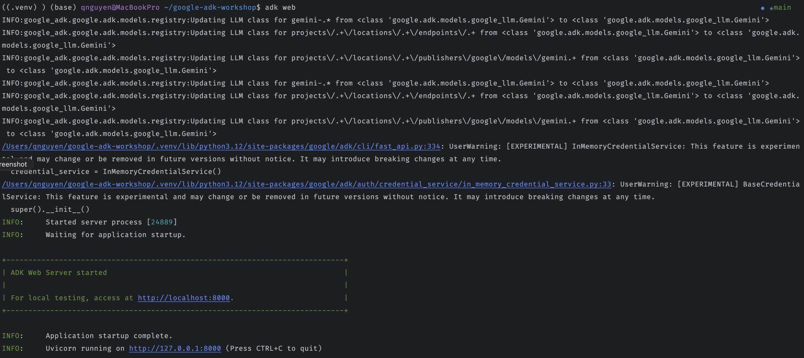

11. Now open your web browser and go to `http://localhost:8000`. 
    You will see the WebUI for your agent like image below.
    In the web UI, select the `my-first-agent` agent from the dropdown list.
    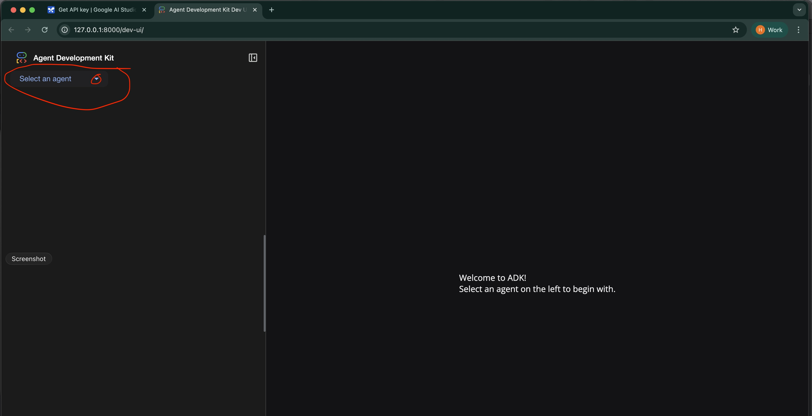

12. After selected the agent, you will see the page changed like below image.
    See that you will now have a text input box to type your chat with the agent.
    Type something like `What is the weather today?` and press `Enter`.
    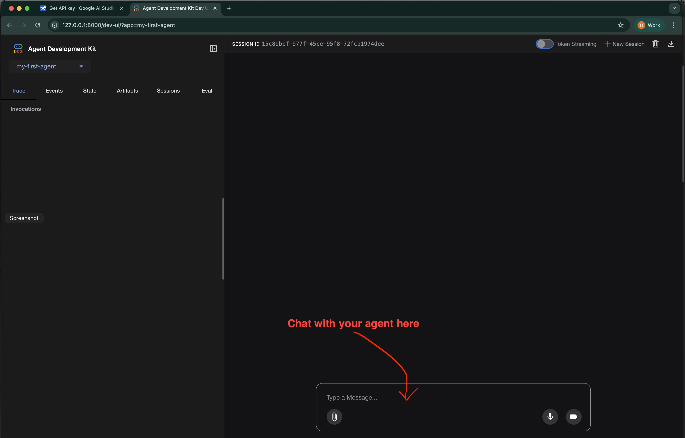

13. You will see the agent response like below.
    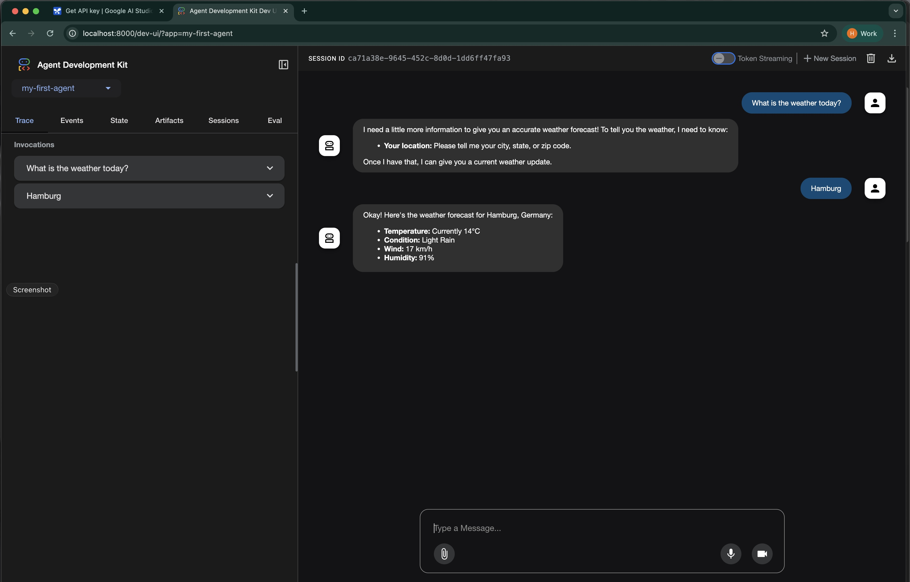

14. Congratulations! You have just created your first agent with Google ADK and tested it with the WebUI.

### D. Bonus: Let's try out the DJ Agent

1. You can see that in the project folder there is already a folder named `my_noob_dj` which is a DJ Agent project.
   Open the `my_noob_dj` folder and you will see the following files:
   - `agent.py`: This is the AI agent code that will control the DJ table.
   - `dj_table_mcp.py`: This is the DJ table code that will provide functions to AI agent to control the music generation.

2. Let's start the DJ Agent by executing the following command in the VSCode Terminal (Tips: open a new Terminal tabs if needed):
   ```bash
   python my_noob_dj/dj_table_mcp.py
   ```
   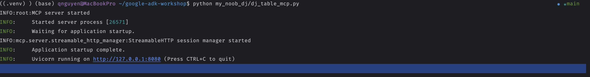

3. Since the previous command will not finish since it is a program. 
Start the WebUI for the DJ Agent by executing the following command in the new VSCode Terminal:
   ```bash
   adk web
   ```
   
4. Open your web browser and go to `http://localhost:8000`. Select the `my_noob_dj` agent from the dropdown list.

5. Now let's become a DJ! Type something like `Let's play some music` and press `Enter`.
   You will see the DJ Agent response like below. And the music should be playing after 1 or 2 seconds.
   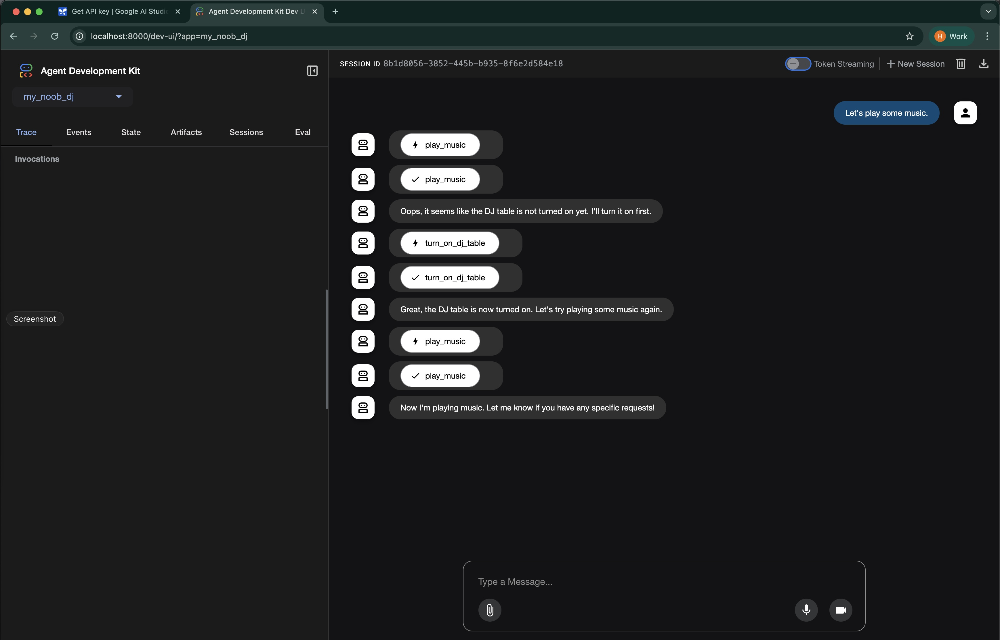

6. By default the music you hear may sound a bit lofi electronic. 
   You can try to change the music kind by typing something like `Let's play some heavy metal rock music` and press `Enter`.
   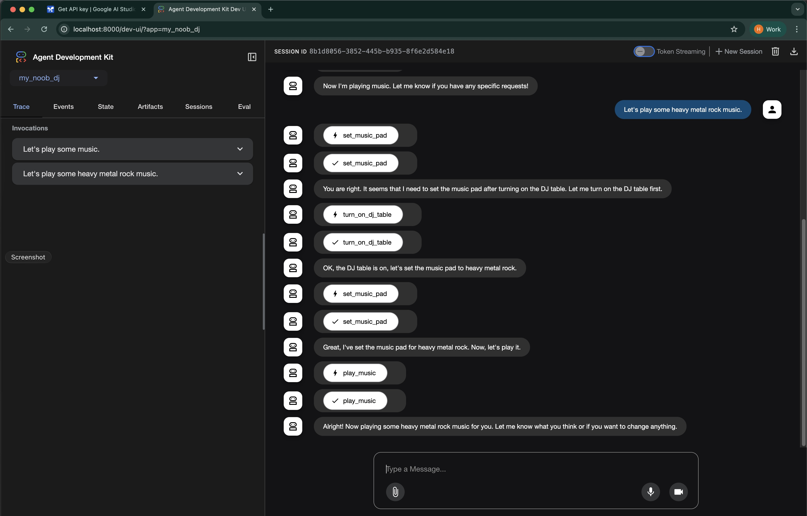

7. Now your're rocking! Enjoy the music and have fun with your DJ Agent!