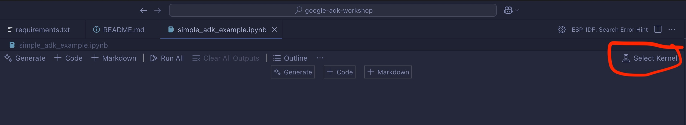

# DJ Agent Project with Google ADK

### Setup environment

1. Open this project in VSCode

2. Open Terminal in VSCode by

   a. Pressing `Cmd + Shift + P` (on MacOS) or `Ctrl + Shift + P` (on Windows) to open the `Command Pallet` on VSCode.

   b. In `Command Pallet`, type to search for `Terminal` then select `Terminal: Create New Terminal (In Active Workspace)`. Example below.
   

3. Then create a virtual environment for this project by executing the following command in the Terminal.

   ```
   python -m venv .venv
   ```

   

   ###### What is virtual environment ?

   > A python environment is can be easily understand as a collection of all python libraries and tools that are installed and for your coding.

   > When you installed python for the first time there will be a global python environment, created at your machine level and will be used for all of your project by default.

   > However if you have multiple projects that require different libraries, sometime they will conflict with each other, especially for the version of the library. For example, project `cool-web-server` requires library `flask` version `3.1.0` while project `old-but-gold` use libry `flask` version `2.3.0`. So when we install library `flash` version `3.1.0` it will break code of project `old-but-gold`.

   > Virtual environment then come to help as a solution for us to create a separate python environment per project. Hence we don't have to worry about if install library for project `A` may break project `B`.

4. You will now see a new folder named `.venv` which storing our new python virtual environment. We will need to tell VSCode to use python in this virtual environment.

   a. Open the `Command Pallet` again and search for `Python: Select Interpreter`
   

   b. A new Pallet will be open and you need to select the python environment that you have just created above by typing in the text box `.venv` and select the one that pointing to the virtual environment folder `.venv`.
   

5. Now you all set. Restart VSCode and reopen the project for it to reload with your new virtual environment.

6. Now open the `Terminal` of VSCode again and this time we will install libraries for this project.

   a. If you have Python version < 3.13, then you can skip this step. Now if you have python version >= 3.13 then we will need to install pip first. In `Terminal` of VSCode, execute the following command to install pip. If this step finished then you can go to step `b`.

   ```
   python -m ensurepip --upgrade
   ```

   b. Install libraries listed on `requirements.txt` file by execute the following command in `Ternimal` of VSCode.

   ```
   pip install -r requirements.txt
   ```

7. Now you have your python virtual environment all set. Let's get started.

#### **Extra Notes**

> Everytime you open a notebook file `*.ipynb` file. Check if your notebook Kernel is set to the python virtual environment created above. If the Kernel show `Select Kernel` like below, then notebook's kernel is not set. We will need to set it with next steps.



> If notebook's kernel is not set then press that `Select Kernel` button. A dropdown from the top will be shown. Select `Python Environments...`.


> A another Pallet will be shown, type in `.venv` and select the one that point to our `.venv` folder.


### Explore first notebook
